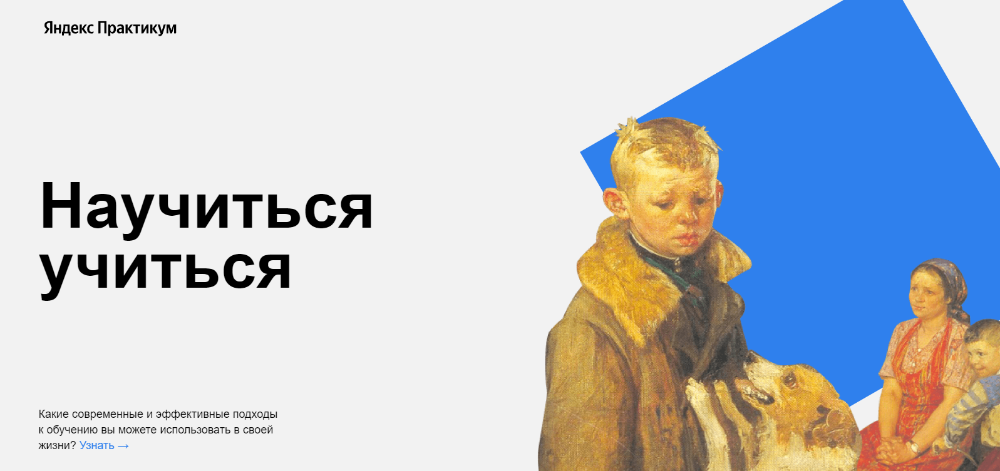

 
<h1>HOW TO LEARN</h1>
<h2>Проектная работа 2.</h2>
<a src="https://opigon1.github.io/how-to-learn/">Ссылка на GitPage</a>

Во второй проектной работе моим заданием было формирование файловой структуры по БЭМ-у, добовление новых секций, а так же работа с простыми анимациями

Были применены такие технологии как:

<ol>
  <li>HTML 5</li>
  <li>CSS 3</li>
  <li>Flexbox</li>
  <li>Keyframes</li>
  <li>Animation</li>
</ol>

Были изучены расширенные возможности HTML, CSS

Планы на дороботку

<ul>
  <li>подключить другие шрифты;</li>
  <li>добавить любимые образовательные видео;</li>
  <li>проверить код на кроссбраузерность и дописать все вендорные префиксы;</li>
  <li>задизайнить форму, через которую пользователи смогут отправить вам комментарий.</li>
</ul>
